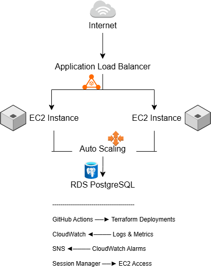

# NordicCart AWS Platform

Production-style AWS infrastructure project for a simulated European e-commerce company.

---

## Project Goals

- High availability
- Infrastructure as Code
- Secure networking
- CI/CD automation
- Autoscaling
- Monitoring & alerting
- Bastionless administration
- Disaster recovery planning

---

## Implemented AWS Services

- VPC
- EC2
- Auto Scaling Groups
- Application Load Balancer
- RDS PostgreSQL
- S3
- CloudFront
- IAM
- CloudWatch
- SNS
- Systems Manager
- WAF

---

## Tech Stack

- AWS
- Terraform
- GitHub Actions
- Python Flask
- Nginx

---

## Deployment

Infrastructure is provisioned using Terraform.

CI/CD validation is automated with GitHub Actions.

Key commands:

terraform init
terraform validate
terraform plan
terraform apply

## Security

- EC2 SSH access disabled
- Bastionless administration using AWS Systems Manager
- Private database subnets
- Security-group restricted traffic
- IAM role-based permissions

## Monitoring

- CloudWatch dashboards
- SNS email alerts
- Centralized application logs
- Auto Scaling monitoring

## Architecture Goals

- Multi-AZ deployment
- Private application subnets
- Private database subnets
- Secure IAM practices
- Automated deployments
- Monitoring and alerting
- Cost-conscious infrastructure

## Current Implementation Status

### Infrastructure
- [x] Custom VPC
- [x] Public and private subnets
- [x] Internet Gateway
- [x] Route tables
- [x] Security groups

### Compute
- [x] EC2 Auto Scaling Group
- [x] Launch Templates
- [x] Application Load Balancer

### Database
- [x] RDS PostgreSQL
- [x] Private DB subnets

### Monitoring
- [x] CloudWatch dashboard
- [x] CloudWatch alarms
- [x] SNS email alerts
- [x] Centralized application logging

### Security
- [x] IAM roles
- [x] Session Manager access
- [x] Bastionless administration
- [x] SSH access removed

### DevOps
- [x] GitHub Actions CI/CD
- [x] Terraform validation pipeline
- [x] Modular Terraform architecture

## Architecture Highlights

- Multi-AZ deployment
- Auto-healing infrastructure using Auto Scaling Groups
- Bastionless EC2 administration through AWS Systems Manager
- Infrastructure fully managed with Terraform
- CI/CD validation using GitHub Actions
- Centralized monitoring and logging with CloudWatch

## Architecture Diagram

